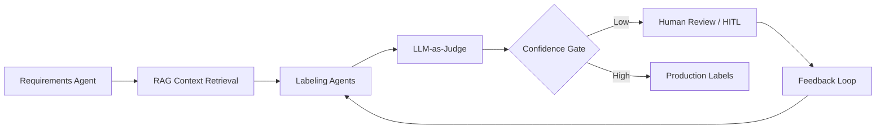
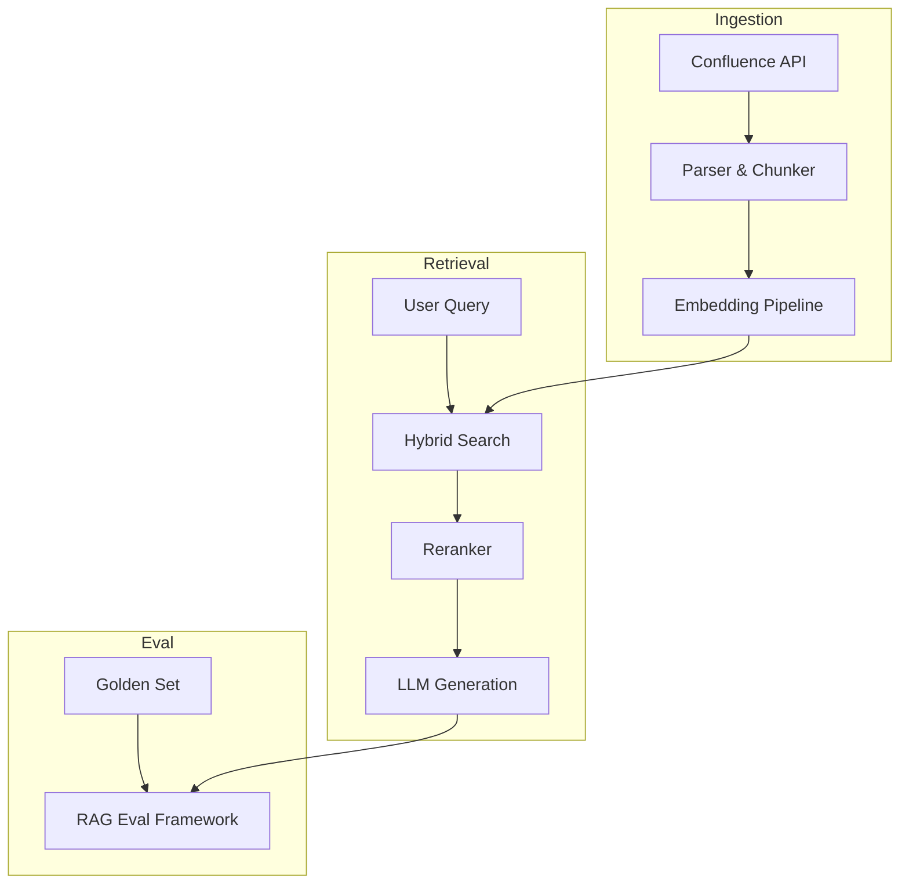
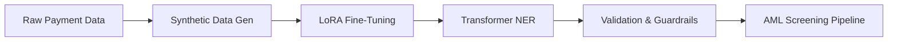

<!-- Banner: replace src with your custom banner image when ready -->

### **Senior AI Engineer · Enterprise RAG · Multi-Agent Systems · KYC/AML**

*Building production-grade agentic AI where regulatory precision meets scalable LLM engineering.*

---

## About

Senior Applied ML Scientist with **7+ years** designing and shipping **agentic AI systems** for global financial institutions. I bridge **deep LLM engineering** — RAG, multi-agent orchestration, fine-tuning, and observability — with **high-stakes compliance workflows** (KYC/AML, payment screening, document intelligence).

| Domain | Highlights |
| :--- | :--- |
| **Impact** | NLP precision **~50% → 90%+** · **50%** automation throughput lift · **30%** fewer post-deploy correction cycles |
| **Leadership** | GenAI technical strategy across **5+** enterprise deployments · Executive stakeholder engagement at Tier-1 banks |
| **Current** | **Senior AI Engineer** @ WorkFusion — Applied ML & Generative AI |

---

## Tech Stack

### AI / LLMs / Agents

### Data / Backend

### Compliance & ML

---

## Featured Open-Source Projects

> Production-minded systems at the intersection of **agentic AI**, **enterprise retrieval**, and **financial compliance**.

 

### 1 · [`multi-agent-kyc-labeling-platform`](https://github.com/rsong0606/multi-agent-kyc-labeling-platform)

| | |
| :--- | :--- |
| **Problem** | KYC/AML labeling at scale demands scarce SME time, inconsistent annotation quality, and slow feedback loops across high-stakes compliance tasks. |
| **Solution** | A reusable **multi-agent labeling framework** — specialized agent roles for requirements discovery, RAG-grounded annotation, and review — with **HITL sampling** and an **LLM-as-Judge** validation layer. |
| **Engineering** | **10+** client adoptions · **1M+** requests/cycle · **+35%** annotation accuracy · **−60%** human training-data dependency · **90%+** production SLA precision |

**Stack:** LangGraph · RAG · HITL · LLM-as-Judge · Python

---

### 2 · [`enterprise-confluence-rag`](https://github.com/rsong0606/enterprise-confluence-rag)

| | |
| :--- | :--- |
| **Problem** | Enterprise knowledge locked in Confluence is hard to retrieve accurately — noisy ingestion, stale chunks, and unmeasured retrieval quality block trustworthy GenAI adoption. |
| **Solution** | An **enterprise-grade RAG pipeline** with structured Confluence ingestion, **hybrid dense + sparse search**, reranking, and a built-in **evaluation framework** (faithfulness, recall@k, latency SLAs). |
| **Engineering** | Production-ready ingestion & chunking · Hybrid retrieval architecture · Automated eval harness for regression-safe deployments |

**Stack:** LlamaIndex · Vector DBs · Hybrid Search · FastAPI · Eval Frameworks

---

### 3 · [`KYC-NER`](https://github.com/rsong0606/KYC-NER)

| | |
| :--- | :--- |
| **Problem** | Payment screening NER models struggle on rare financial entities — low baseline precision forces heavy manual analyst review and blocks AML automation throughput. |
| **Solution** | A **Transformer-based NER pipeline** with domain-specific entity taxonomy, **synthetic data generation**, and **LoRA/PEFT fine-tuning** optimized for real-world payment-screening distributions. |
| **Engineering** | **~50% → 90%+** NER precision (**+80%** lift) · **+50%** automation throughput · **−40%** retraining latency · Tier-1 institution deployment |

**Stack:** Hugging Face Transformers · LoRA/PEFT · PyTorch · Synthetic Data · NER

---

## Professional Snapshot

| Experience | Role | Focus |
| :--- | :--- | :--- |
| **WorkFusion** · May 2021 – Present | Senior AI Engineer | GenAI strategy · 10+ LLM document systems · MLOps guardrails · Executive delivery |
| **WorkFusion** · Nov 2018 – May 2021 | Data Scientist | Production ML pipelines · NLP automation · Entity extraction |

**Education**

| Degree | Institution | Notes |
| :--- | :--- | :--- |
| M.S. Business Intelligence & Analytics | Stevens Institute of Technology | GPA 3.73 · Dean's List |
| B.A. Economics & Mathematics | Indiana University Bloomington | GPA 3.2 |

**Recent Certifications**

`DeepLearning.AI` Transformer Architectures · Vector DB RAG · Quantization · LLM Serving · LLMOps Testing  
`LangChain Academy` LangGraph · Agentic AI & HITL Orchestration

---

## Let's Connect

I'm always interested in conversations around **production GenAI**, **compliance automation**, and **multi-agent system design**.

---

*Building AI systems that compliance teams can trust — and engineering teams can scale.*

